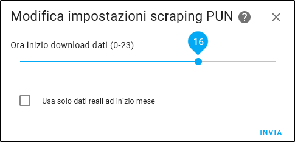
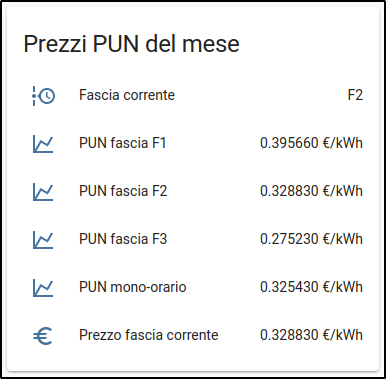

# Prezzi PUN del mese

Integrazione per **Home Assistant** (basata sullo script [pun-fasce](https://github.com/virtualdj/pun-fasce)) che mostra i prezzi stimati del mese corrente per fasce orarie (F1, F2 e F3 e mono-oraria) nonché la fascia oraria attuale.

I valori vengono scaricati dal sito [MercatoElettrico.org](https://www.mercatoelettrico.org/It/Default.aspx) per l'intero mese e viene calcolata la media per fasce giorno per giorno, in questo modo verso la fine del mese il valore mostrato si avvicina sempre di più al prezzo reale del PUN in bolletta (per i contratti a prezzo variabile).

## Installazione in Home Assistant

Installare usando [HACS](https://hacs.xyz/) tramite il menu con i tre puntini nell'angolo in alto a destra e scegliendo _Add custom repository_ e aggiungendo l'URL https://github.com/virtualdj/pun_sensor alla lista.

Installare **manualmente** clonando o copiando questa repository e poi copiando la cartella `custom_components/pun_sensor` nella cartella `/custom_components/pun_sensor` di Home Assistant, che andrà successivamente riavviato.

### Configurazione

Dopo l'aggiunta dell'integrazione oppure cliccando il pulsante _Configurazione_ nelle impostazioni di Home Assistant, verrà visualizzata questa finestra:

Qui è possibile selezionare un'orario del giorno in cui scaricare i prezzi aggiornati dell'energia (default: 1). Nel caso il sito non fosse raggiungibile, verranno effettuati altri tentativi dopo 10, 60, 120 e 180 minuti.

Se la casella di controllo _Usa solo dati reali ad inizio mese_ è **attivata** all'inizio del mese quando non ci sono i prezzi per tutte le fasce orarie questi vengono disabilitati (non viene mostrato quindi un prezzo in €/kWh finché i dati non sono sufficiente); nel caso invece la casella fosse **disattivata** (default) nel conteggio vengono inclusi gli ultimi giorni del mese precedente in modo da avere sempre un valore in €/kWh.

### Aspetto dei dati

L'integrazione fornisce il nome della fascia corrente relativa all'orario di Home Assistant (tra F1 / F2 / F3), i prezzi delle tre fascie F1 / F2 / F3 più la fascia mono-oraria e il prezzo della fascia corrente.